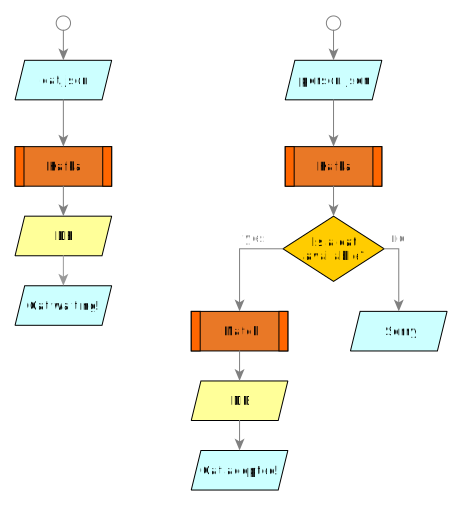

# Camel K Orchestration Example

This example demonstrates how to orchestrate integrations using Camel-K and Kafka.

We are going to implement two integrations that interact through a database to simulate how cat adoptions work. 



One integration will store cats coming from Kafka to the database waiting for a person to adopt them. The second integration will receive people interested in adopting and will match cats with them.

## 0. Before you begin

Make sure you check-out this repository from git and open it with [VSCode](https://code.visualstudio.com/).

Instructions are based on [VSCode Didact](https://github.com/redhat-developer/vscode-didact), so make sure it's installed from the VSCode extensions marketplace.

From the VSCode UI, right-click on the `readme.didact.md` file and select "Didact: Start Didact tutorial from File". A new Didact tab will be opened in VS Code.

Make sure you've opened this readme file with Didact before jumping to the next section.

### Preparing the cluster

This example can be run on any OpenShift 4.3+ cluster or a local development instance (such as [CRC](https://github.com/code-ready/crc)). Ensure that you have a cluster available and login to it using the OpenShift `oc` command line tool.

You need to create a new project named `camel-orchestration` for running this example. This can be done directly from the OpenShift web console or by executing the command `oc new-project camel-orchestration` on a terminal window.

```
oc new-project camel-orchestration
```
([^ execute](didact://?commandId=vscode.didact.sendNamedTerminalAString&text=camelTerm$$oc%20new-project%20camel-orchestration&completion=New%20project%20created. "Opens a new terminal and sends the command above"){.didact})

#### Installed Operators

For this exercise we will need the Camel K, Strimzi and PostgreSQL operators installed on our project.

To do so, go to the OpenShift 4.x web console, login with a cluster admin account and use the OperatorHub menu item on the left to find and install **"Camel K Operator"**, **"Strimzi"** and **"PostgreSQL Operator by Dev4Ddevs.com"**. You will be given the option to install it globally on the cluster or on a specific namespace.

If using a specific namespace, make sure you select the `camel-orchestration` project from the dropdown list. 

The installation may take a couple of minutes.

When the operator **"Camel K Operator"** is installed, from the OpenShift Help menu ("?") at the top of the WebConsole, you can access the "Command Line Tools" page, where you can download the **"kamel"** CLI, that is required for running this example. The CLI must be installed in your system path.

You can use the following section to check if your environment is configured properly.

After successful installation, we'll configure an `IntegrationPlatform` with specific default settings using the following command:

```
kamel install --olm=false --skip-cluster-setup --skip-operator-setup --maven-repository  https://jitpack.io@id=jitpack
```
([^ execute](didact://?commandId=vscode.didact.sendNamedTerminalAString&text=camelTerm$$kamel%20install%20--olm=false%20--skip-cluster-setup%20--skip-operator-setup%20--maven-repository%20https://jitpack.io@id=jitpack@snapshots&completion=Camel%20K%20IntegrationPlatform%20creation. "Opens a new terminal and sends the command above"){.didact})

NOTE: We use `Jitpack` to package the model project into a shared JAR that will be used by all integrations in this project, hence we add https://jitpack.io to the list of Maven repositories known to the operator. This configuration is handy but experimental and it may change in the GA version. In a production scenario, we suggest you to deploy the model JAR into your own Maven registry and reference it in the platform configuration.

Camel K should have created an IntegrationPlatform custom resource in your project. To verify it:

```
oc get integrationplatform
```
([^ execute](didact://?commandId=vscode.didact.sendNamedTerminalAString&text=camelTerm$$oc%20get%20integrationplatform&completion=Camel%20K%20integration%20platform%20verification. "Opens a new terminal and sends the command above"){.didact})

If everything is ok, you should see an IntegrationPlatform named `camel-k` with phase `Ready` (it can take some time for the 
operator to being installed).

### Checking requirements

<a href='didact://?commandId=vscode.didact.validateAllRequirements' title='Validate all requirements!'><button>Validate all Requirements at Once!</button></a>

**OpenShift CLI ("oc")**

The OpenShift CLI tool ("oc") will be used to interact with the OpenShift cluster.

[Check if the OpenShift CLI ("oc") is installed](didact://?commandId=vscode.didact.cliCommandSuccessful&text=oc-requirements-status$$oc%20help&completion=Checked%20oc%20tool%20availability "Tests to see if `oc help` returns a 0 return code"){.didact}

*Status: unknown*{#oc-requirements-status}

**Connection to an OpenShift cluster**

You need to connect to an OpenShift cluster in order to run the examples.

[Check if you're connected to an OpenShift cluster](didact://?commandId=vscode.didact.requirementCheck&text=cluster-requirements-status$$oc%20get%20project$$NAME&completion=OpenShift%20is%20connected. "Tests to see if `kamel version` returns a result"){.didact}

*Status: unknown*{#cluster-requirements-status}

**Apache Camel K CLI ("kamel")**

Apart from the support provided by the VS Code extension, you also need the Apache Camel K CLI ("kamel") in order to 
access all Camel K features.

[Check if the Apache Camel K CLI ("kamel") is installed](didact://?commandId=vscode.didact.requirementCheck&text=kamel-requirements-status$$kamel%20version$$Camel%20K%20Client&completion=Apache%20Camel%20K%20CLI%20is%20available%20on%20this%20system. "Tests to see if `kamel version` returns a result"){.didact}

*Status: unknown*{#kamel-requirements-status}

#### Optional Requirements

The following requirements are optional. They don't prevent the execution of the demo, but may make it easier to follow.

**VS Code Extension Pack for Apache Camel**

The VS Code Extension Pack for Apache Camel by Red Hat provides a collection of useful tools for Apache Camel K developers,
such as code completion and integrated lifecycle management. They are **recommended** for the tutorial, but they are **not**
required.

You can install it from the VS Code Extensions marketplace.

[Check if the VS Code Extension Pack for Apache Camel by Red Hat is installed](didact://?commandId=vscode.didact.extensionRequirementCheck&text=extension-requirement-status$$redhat.apache-camel-extension-pack&completion=Camel%20extension%20pack%20is%20available%20on%20this%20system. "Checks the VS Code workspace to make sure the extension pack is installed"){.didact}

*Status: unknown*{#extension-requirement-status}

## 1. Preparing the project

We'll connect to the `camel-orchestration` project and check the installation status, which should be fine if followed the previous steps.

Open a terminal tab and type the following command:

```
oc project camel-orchestration
```
([^ execute](didact://?commandId=vscode.didact.sendNamedTerminalAString&text=camelTerm$$oc%20project%20camel-orchestration&completion=New%20project%20creation. "Opens a new terminal and sends the command above"){.didact})

Upon successful creation, you should ensure that the Camel K, PostgreSQL and Kafka operators are installed.

We should now check that the operator is installed. To do so, execute the following command on a terminal:

```
oc get csv
```
([^ execute](didact://?commandId=vscode.didact.sendNamedTerminalAString&text=camelTerm$$oc%20get%20csv&completion=Checking%20Cluster%20Service%20Versions. "Opens a new terminal and sends the command above"){.didact})

You should get an output similar to this one:

```$ oc get csv
NAME                               DISPLAY                                VERSION   REPLACES                           PHASE
camel-k-operator.v1.1.1            Camel K Operator                       1.1.1     camel-k-operator.v1.1.0            Succeeded
postgresql-operator.v0.1.1         PostgreSQL Operator by Dev4Ddevs.com   0.1.1                                        Succeeded
strimzi-cluster-operator.v0.19.0   Strimzi                                0.19.0    strimzi-cluster-operator.v0.18.0   Succeeded
```

All operators should have an entry in phase `Succeeded`.


## 2. Setting up complementary database

This example uses a PostgreSQL database. We want to install it on a the project `camel-orchestration`. We can go to the OpenShift 4.x WebConsole page, use the OperatorHub menu item on the left hand side menu and use it to find and install "PostgreSQL Operator by Dev4Ddevs.com". This will install the operator and may take a couple minutes to install.

Once the operator is installed, we can create a new database using

```
oc create -f resources/postgres.yaml -n camel-orchestration
```
([^ execute](didact://?commandId=vscode.didact.sendNamedTerminalAString&text=camelTerm$$oc%20create%20-f%20resources%2Fpostgres.yaml%20-n%20camel-orchestration&completion=Create%20Database. "Create database"){.didact})

We connect to the database pod to create a table and add data to be extracted later.

```
oc rsh $(oc get pods -o custom-columns=POD:.metadata.name --no-headers | grep mypostgre | grep -v deploy)
```

([^ execute](didact://?commandId=vscode.didact.sendNamedTerminalAString&text=camelTerm$$oc%20rsh%20$(oc%20get%20pods%20-o%20custom-columns=POD:.metadata.name%20--no-headers%20%7C%20grep%20mypostgre%20%7C%20grep%20-v%20deploy)&completion=Connected%20to%20pod. "oc rsh pod"){.didact})

```
psql -U camel-k-orchestration orchestration \
-c "CREATE TABLE cat (id SERIAL PRIMARY KEY, name VARCHAR NOT NULL, person VARCHAR, image VARCHAR);"
```

([^ execute](didact://?commandId=vscode.didact.sendNamedTerminalAString&text=camelTerm$$psql%20-U%20camel-k-orchestration%20orchestration%20-c%20%22CREATE%20TABLE%20cat%20(id%20SERIAL%20PRIMARY%20KEY,%20name%20VARCHAR%20NOT%20NULL,%20person%20VARCHAR,%20image%20VARCHAR);%22&completion=Created%20table%20and%20added%20data. "psql create table"){.didact})

```
exit
```

([^ execute](didact://?commandId=vscode.didact.sendNamedTerminalAString&text=camelTerm$$exit&completion=Pod%20connection%20closed. "Pod connection closed."){.didact})

## 3. Setting up Kafka Cluster

As we have the Strimzi operator installed, we are ready to create our cluster of Kafkas. 

To do so, we just have to execute the following command:

```
 oc apply -f https://strimzi.io/examples/latest/kafka/kafka-persistent-single.yaml
```

([^ execute](didact://?commandId=vscode.didact.sendNamedTerminalAString&text=camelTerm$$oc%20apply%20-f%20https%3A%2F%2Fstrimzi.io%2Fexamples%2Flatest%2Fkafka%2Fkafka-persistent-single.yaml&completion=Cluster%20being%20created. "Sends the command above"){.didact})

We should explicitly wait for the cluster to be created.

```
oc wait kafka/my-cluster --for=condition=Ready --timeout=300s
```

([^ execute](didact://?commandId=vscode.didact.sendNamedTerminalAString&text=camelTerm$$oc%20wait%20kafka%2Fmy-cluster%20--for%3Dcondition%3DReady%20--timeout%3D300s&completion=Cluster%20created. "Sends the command above"){.didact})

We are going to create two kafka brokers that will be the entry points for all data in our integrations.

The following commands will create new tabs on the terminal. Make sure you run them on a separated terminal, as these commands will not return, they will be waiting for input messages.

```
 oc run kafka-cat -ti --image=strimzi/kafka:0.19.0-kafka-2.5.0 --rm=true --restart=Never -- bin/kafka-console-producer.sh --broker-list my-cluster-kafka-bootstrap:9092 --topic cat
 ```

([^ execute](didact://?commandId=vscode.didact.sendNamedTerminalAString&text=Kafka1$$oc%20run%20kafka-cat%20-ti%20--image%3Dstrimzi%2Fkafka%3A0.19.0-kafka-2.5.0%20--rm%3Dtrue%20--restart%3DNever%20--%20bin%2Fkafka-console-producer.sh%20--broker-list%20my-cluster-kafka-bootstrap%3A9092%20--topic%20cat&completion=Cluster%20created. "Sends the command above"){.didact})

```
 oc run kafka-person -ti --image=strimzi/kafka:0.19.0-kafka-2.5.0 --rm=true --restart=Never -- bin/kafka-console-producer.sh --broker-list my-cluster-kafka-bootstrap:9092 --topic person
 ```

([^ execute](didact://?commandId=vscode.didact.sendNamedTerminalAString&text=Kafka2$$oc%20run%20kafka-personcat%20-ti%20--image%3Dstrimzi%2Fkafka%3A0.19.0-kafka-2.5.0%20--rm%3Dtrue%20--restart%3DNever%20--%20bin%2Fkafka-console-producer.sh%20--broker-list%20my-cluster-kafka-bootstrap%3A9092%20--topic%20person&completion=Cluster%20created. "Sends the command above"){.didact})

Now that we have two topics created in Kafka, we can work in our integrations.

## 3. Running the Integrations

We are going to run in parallel some integrations that will be orchestrated to interact together.

### a) Cat Input from Kafka to Database

First we are going to implement the storage of cat input messages to the database.

The integration is all contained in a single file named `CatInput.java` ([open](didact://?commandId=vscode.openFolder&projectFilePath=CatInput.java&completion=Opened%20the%20CatInput.java%20file "Opens the CatInput.java file"){.didact}).

> **Note:** the `CatInput.java` file contains an integration that uses some components.
> Dependency management is automatically handled by Camel K that imports all required libraries from the Camel
> catalog via code inspection. This means you can use all 300+ Camel components directly in your routes.

We're ready to run the integration on our cluster.

Use the following command to run the CatInput integration:

```
kamel run CatInput.java
```
([^ execute](didact://?commandId=vscode.didact.sendNamedTerminalAString&text=camelTerm$$kamel%20run%20CatInput.java&completion=Camel%20K%20integration%20running. "Opens a new terminal and sends the command above"){.didact})

If everything is ok, after the build phase finishes, the integration will be running and waiting for messages from the Kafka broker topic "cat".

After executing the command, you should be able to see it among running integrations:

```
oc get integrations
```
([^ execute](didact://?commandId=vscode.didact.sendNamedTerminalAString&text=camelTerm$$oc%20get%20integrations&completion=Getting%20running%20integrations. "Opens a new terminal and sends the command above"){.didact})

An integration named `cat-input` should be present in the list and it should be in status `Running`. 

There's also a `kamel get` command which is an alternative way to list all running integrations.

> **Note:** the first time you've run the integration, an IntegrationKit (basically, a container image) has been created for it and 
> it took some time for this phase to finish. When you run the integration a second time, the existing IntegrationKit is reused 
> (if possible) and the integration reaches the "Running" state much faster.
>

You can see the logs of the integration using the following command:

```
kamel log cat-input
```
([^ execute](didact://?commandId=vscode.didact.sendNamedTerminalAString&text=camelTerm$$kamel%20log%20cat-input&completion=Show%20integration%20logs. "Opens a new terminal and sends the command above"){.didact})

The last parameter is the name of the running integration for which you want to display the logs.

The log will show up some messages whenever we send some text through the cat broker stream.

Now we can try sending some cat data through Kafka, like:

```
{'name': 'Princess Lollipop', 'image': 'https://cdn2.thecatapi.com/images/7j2.jpg'}
```
([^ execute](didact://?commandId=vscode.didact.sendNamedTerminalAString&text=Kafka1$$%7B'name'%3A%20'Princess%20Lollipop'%2C%20'image'%3A%20'https%3A%2F%2Fcdn2.thecatapi.com%2Fimages%2F7j2.jpg'%7D&completion=Princess%20Lollipop%20arrived. "Opens a new terminal and sends the command above"){.didact})

```
{'name': 'Lady Tuna Whiskers', 'image': 'https://cdn2.thecatapi.com/images/bl2.jpg'}
```
([^ execute](didact://?commandId=vscode.didact.sendNamedTerminalAString&text=Kafka1$$%7B'name'%3A%20'Lady%20Tuna%20Whiskers'%2C%20'image'%3A%20'https%3A%2F%2Fcdn2.thecatapi.com%2Fimages%2Fbl2.jpg'%7D&completion=Lady%20Tuna%20arrived. "Opens a new terminal and sends the command above"){.didact})

Notice that this will be sent to the terminal with the Kafka cat topic waiting for input. You have to go back to the 'camelTerm' terminal to see the logs of the integration.

Now, let's close the log on cat-input and move on to the next integration.

[**Click here to terminate the log stream**](didact://?commandId=vscode.didact.sendNamedTerminalCtrlC&text=camelTerm&completion=Camel%20K%20integration%20interrupted. "Interrupt the current operation on the terminal"){.didact} 
or hit `ctrl+c` on the terminal window.

> **Note:** Your IDE may provide an "Apache Camel K Integrations" panel where you can see the list of running integrations and also open a window to display the logs.

### b) Person Input from Kafka to Adopt

Now we are going to implement the reception of people wanting to adopt a cat.

The integration is all contained in a single file named `PersonInput.java` ([open](didact://?commandId=vscode.openFolder&projectFilePath=PersonInput.java&completion=Opened%20the%20PersonInput.java%20file "Opens the PersonInput.java file"){.didact}).

Use the following command to run it:

```
kamel run PersonInput.java
```

([^ execute](didact://?commandId=vscode.didact.sendNamedTerminalAString&text=camelTerm$$kamel%20run%20PersonInput.java&completion=Camel%20K%20integration%20running%20mode. "Opens a new terminal and sends the command above"){.didact})

If everything is ok, after the build phase finishes, the integration will be running and waiting for messages from the Kafka broker topic "person".

You can see the logs of the integration using the following command:

```
kamel log person-input
```
([^ execute](didact://?commandId=vscode.didact.sendNamedTerminalAString&text=camelTerm$$kamel%20log%20person-input&completion=Show%20integration%20logs. "Opens a new terminal and sends the command above"){.didact})

Now we can send persons to the Kafka stream:

```
Antonia 
```
([^ execute](didact://?commandId=vscode.didact.sendNamedTerminalAString&text=Kafka2$$Antonia&completion=Antonia%20arrived. "Opens a new terminal and sends the command above"){.didact})

```
Fulgencio 
```
([^ execute](didact://?commandId=vscode.didact.sendNamedTerminalAString&text=Kafka2$$Fulgencio&completion=Fulgencio%20arrived. "Opens a new terminal and sends the command above"){.didact})

```
Segisvaldo 
```
([^ execute](didact://?commandId=vscode.didact.sendNamedTerminalAString&text=Kafka2$$Segisvaldo&completion=Segisvaldo%20arrived. "Opens a new terminal and sends the command above"){.didact})

As you can see, there are no cats available for Segisvaldo.

Our basic workflow is finished: we can send cats through the Kafka cat topic that will be waiting on a table on the database for some person that arrives through the Kafka person topic to adopt them.

Now, let's close the log of person-input and move on to the section.

[**Click here to terminate the log stream**](didact://?commandId=vscode.didact.sendNamedTerminalCtrlC&text=camelTerm&completion=Camel%20K%20integration%20interrupted. "Interrupt the current operation on the terminal"){.didact} 
or hit `ctrl+c` on the terminal window.

## 4. Jobs to add data automatically

Right now, the Kafka streams are feed manually. But we can also feed them automatically. Let's add a couple of jobs to do this. 

The manual input will still work, but this shows that you can have more than one process of inputting data to Kafka streams.

### a) Adding cats to the stream

As an extra step on this exercise, we are going to implement a final job that sends cat json data to the Kafka "cat" topic with a timer.

The integration is all contained in a single file named `AutoCat.java` ([open](didact://?commandId=vscode.openFolder&projectFilePath=AutoCat.java&completion=Opened%20the%20AutoCat.java%20file "Opens the AutoCat.java file"){.didact}).

Now we run it.

```
kamel run AutoCat.java 
```
([^ execute](didact://?commandId=vscode.didact.sendNamedTerminalAString&text=camelTerm$$kamel%20run%20AutoCat.java&completion=Camel%20K%20integration%20run. "Opens a new terminal and sends the command above"){.didact})

You can see the logs of the integration using the following command:

```
kamel log auto-cat
```
([^ execute](didact://?commandId=vscode.didact.sendNamedTerminalAString&text=camelTerm$$kamel%20log%20auto-cat&completion=Show%20integration%20logs. "Opens a new terminal and sends the command above"){.didact})

If we wait, we will see how this integration generates cats automatically and sends them to the Kafka topic. 

Now, let's close the log of auto-cat and check the cat-input integration to see how the automatic cats are being properly fed.

[**Click here to terminate the log stream**](didact://?commandId=vscode.didact.sendNamedTerminalCtrlC&text=camelTerm&completion=Camel%20K%20integration%20interrupted. "Interrupt the current operation on the terminal"){.didact} 
or hit `ctrl+c` on the terminal window.

```
kamel log cat-input
```
([^ execute](didact://?commandId=vscode.didact.sendNamedTerminalAString&text=camelTerm$$kamel%20log%20cat-input&completion=Show%20integration%20logs. "Opens a new terminal and sends the command above"){.didact})

Now, let's close the log and move on to the section.

[**Click here to terminate the log stream**](didact://?commandId=vscode.didact.sendNamedTerminalCtrlC&text=camelTerm&completion=Camel%20K%20integration%20interrupted. "Interrupt the current operation on the terminal"){.didact} 
or hit `ctrl+c` on the terminal window.

### a) Adding persons to the stream

As an extra step on this exercise, we are going to implement a final job that sends cat json data to the Kafka "person" topic with a timer.

The integration is all contained in a single file named `AutoPerson.java` ([open](didact://?commandId=vscode.openFolder&projectFilePath=AutoPerson.java&completion=Opened%20the%20AutoCat.java%20file "Opens the AutoPerson.java file"){.didact}).

Now we run it.

```
kamel run AutoPerson.java 
```
([^ execute](didact://?commandId=vscode.didact.sendNamedTerminalAString&text=camelTerm$$kamel%20run%20AutoPerson.java&completion=Camel%20K%20integration%20run. "Opens a new terminal and sends the command above"){.didact})

We can watch the logs of the "AutoPerson" integration to see how all the orchestration works.

```
kamel log auto-person
```
([^ execute](didact://?commandId=vscode.didact.sendNamedTerminalAString&text=camelTerm$$kamel%20log%20auto-person&completion=Show%20integration%20logs. "Opens a new terminal and sends the command above"){.didact})

If we wait, we will see how this integration generates persons automatically and sends them to the Kafka topic. 

Now, let's close the log of auto-person and check the person-input integration to see how the automatic cats are being properly fed.

[**Click here to terminate the log stream**](didact://?commandId=vscode.didact.sendNamedTerminalCtrlC&text=camelTerm&completion=Camel%20K%20integration%20interrupted. "Interrupt the current operation on the terminal"){.didact} 
or hit `ctrl+c` on the terminal window.

```
kamel log person-input
```
([^ execute](didact://?commandId=vscode.didact.sendNamedTerminalAString&text=camelTerm$$kamel%20log%20cat-input&completion=Show%20integration%20logs. "Opens a new terminal and sends the command above"){.didact})

Now, let's close the log to finish.

[**Click here to terminate the log stream**](didact://?commandId=vscode.didact.sendNamedTerminalCtrlC&text=camelTerm&completion=Camel%20K%20integration%20interrupted. "Interrupt the current operation on the terminal"){.didact} 
or hit `ctrl+c` on the terminal window.

## 5. Uninstall

To cleanup everything, execute the following command:

```oc delete project camel-orchestration```

([^ execute](didact://?commandId=vscode.didact.sendNamedTerminalAString&text=camelTerm$$oc%20delete%20project%20camel-orchestration&completion=Removed%20the%20project%20from%20the%20cluster. "Cleans up the cluster after running the example"){.didact})

Now you are ready to implement your own orchestrations with Kafka and Camel K.
